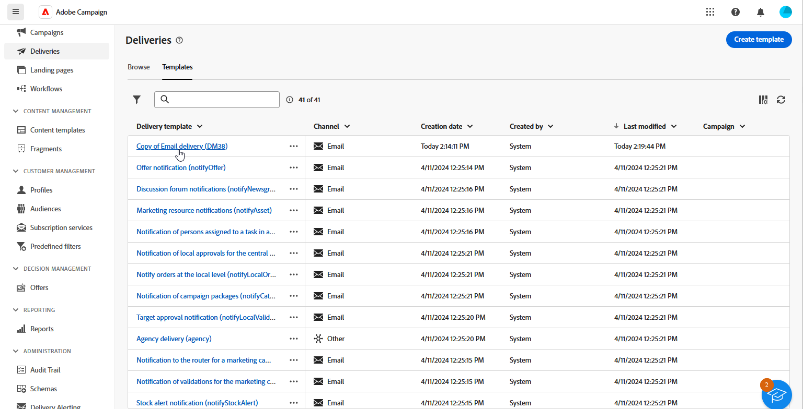
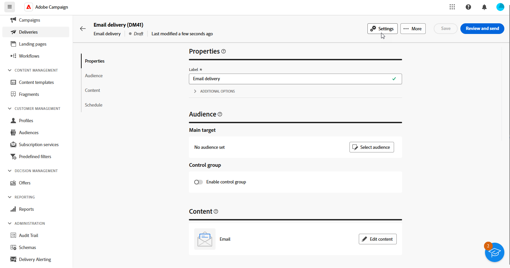

# Tilldela ert varumärke {#branding-assign}

>[!IMPORTANT]
>
>Varumärkesalternativen är för närvarande begränsade till e-post och push-leveranser.

## Länka ett varumärke till en mall {#linking-a-brand-to-a-template}

Om du vill använda de parametrar som definierats för ett varumärke måste det vara länkat till en leveransmall. Om du vill göra det måste du skapa eller redigera en mall.

Din mall kommer att länkas till varumärket. I e-postredigeraren kommer element som **e-postadressen till standardavsändaren**, **standardavsändarens namn** eller **logotypen** att använda konfigurerade varumärkesdata.

>[!BEGINTABS]

>[!TAB Adobe Campaign V8]

Om du vill skapa en leveransmall kan du duplicera en inbyggd mall, konvertera en befintlig leverans till en mall eller skapa en leveransmall från början. [Läs mer](https://experienceleague.adobe.com/en/docs/campaign/campaign-v8/send/create-templates)

När mallen har skapats kan du koppla den till ett varumärke. Så här gör du:

1. Bläddra till **[!UICONTROL Resources]** `>` **[!UICONTROL Templates]** `>` **[!UICONTROL Delivery templates]** i Adobe Campaign Explorer.

1. Välj en leveransmall eller duplicera en befintlig.

   

1. Öppna **[!UICONTROL Properties]** av den leveransmall du valt.

   

1. Från **[!UICONTROL General]** väljer du ditt varumärke på **[!UICONTROL Branding]** nedrullningsbar meny.

   

1. När konfigurationen är klar väljer du **OK**.

Nu kan du använda den här mallen för att skicka leveranser.

>[!TAB Adobe Campaign Web]

Om du vill skapa en leveransmall kan du duplicera en inbyggd mall, konvertera en befintlig leverans till en mall eller skapa en leveransmall från början. [Läs mer](https://experienceleague.adobe.com/en/docs/campaign-web/v8/msg/delivery-template)

När mallen har skapats kan du koppla den till ett varumärke. Så här gör du:

1. Gå till **[!UICONTROL Templates]** -fliken, från **[!UICONTROL Deliveries]** vänster meny och välj en leveransmall.

   

1. Klicka på **[!UICONTROL Settings]**.

   

1. Från **[!UICONTROL Delivery]** -fliken, gå till **[!UICONTROL Branding]** och välj det varumärke som du vill länka till mallen.

   

1. Bekräfta valet och spara mallen.

Nu kan du använda den här mallen för att skicka leveranser.

>[!ENDTABS]

## Tilldela ett varumärke till din leverans {#assigning-a-brand-to-an-email}

>[!BEGINTABS]

>[!TAB Adobe Campaign V8]

Följ stegen nedan för att skapa en ny fristående leverans.

1. Om du vill skapa en ny leverans går du till **[!UICONTROL Campaigns]** -fliken.

1. Klicka **[!UICONTROL Deliveries]** och klicka på **[!UICONTROL Create]** ovanför listan över befintliga leveranser.

   

1. Välj en leveransmall.

1. Öppna **[!UICONTROL Properties]** av den leveransmall du valt.

   

1. Från **[!UICONTROL General]** väljer du ditt varumärke på **[!UICONTROL Branding]** nedrullningsbar meny.

   

1. När konfigurationen är klar väljer du **OK**.

1. Anpassa leveranserna ytterligare. Mer information om hur du skapar e-postmeddelanden finns i [Designa och skicka e-post](https://experienceleague.adobe.com/en/docs/campaign-web/v8/msg/email/create-email) -avsnitt.

>[!TAB Adobe Campaign Web]

Följ stegen nedan för att skapa en ny fristående leverans.

1. Gå till **[!UICONTROL Deliveries]** till vänster och klicka på **[!UICONTROL Create delivery]** -knappen.

   

1. Välj E-post eller Push-meddelande som kanal och välj en leveransmall i listan.

1. Bekräfta genom att klicka på knappen **[!UICONTROL Create delivery]**.

1. Från **[!UICONTROL Properties]** sida, klicka **[!UICONTROL Settings]**.

   

1. Från **[!UICONTROL Delivery]** -fliken, gå till **[!UICONTROL Branding]** fält.

   

1. Markera det varumärke som du vill länka till mallen.

   

1. Anpassa leveranserna ytterligare. Mer information om hur du skapar e-postmeddelanden finns i [Skapa din första e-postadress](https://experienceleague.adobe.com/en/docs/campaign-web/v8/msg/email/create-email) -avsnitt.

>[!ENDTABS]
