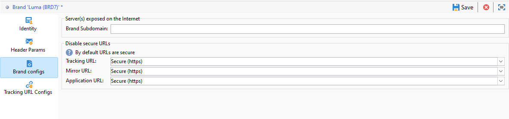

# Konfigurera varumärken {#branding-configure}

>[!IMPORTANT]
>
>Varumärken kan inte skapas eller ändras av slutanvändare: dessa åtgärder måste utföras av den tekniska administratören för Adobe Campaign. Kontakta Adobes kundtjänst om du har frågor.

I Adobe Campaign V8 finns varumärkena i **[!UICONTROL Administration > Platform > Branding]** -menyn.

A **[!UICONTROL Brand]** definieras av följande egenskaper:

* An **[!UICONTROL Identity]** som definierar och personaliserar ert varumärke. Det här avsnittet innehåller följande fält:

   * **[!UICONTROL Label]** synlig i gränssnittet
   * **[!UICONTROL ID]**
   * **[!UICONTROL Brand name]**
   * **[!UICONTROL Website URL]** och **[!UICONTROL Website label]** varumärket
   * **[!UICONTROL Brand logo]**

  

* **[!UICONTROL Header parameters of sent emails]** som anpassar vad mottagarna av dina kampanjer kommer att se. Det här avsnittet innehåller följande fält:

   * **[!UICONTROL Sender (email address)]** med varumärkets e-postadress.
   * **[!UICONTROL Sender (name)]** med varumärkets namn.
   * **[!UICONTROL Reply to (email address)]** med den e-postadress som kunden kan svara på.
   * **[!UICONTROL Reply to (name)]** med varumärkets namn.
   * **[!UICONTROL Error (email address)]** med den e-postadress som ska användas om ett fel uppstår.

  >[!IMPORTANT]
  >
  >Om avsändarens namn och e-postadress inte har ändrats i det e-postmeddelande som skapas från mallen ska du kontrollera mallens avancerade inställningar när du har uppdaterat rubrikparametrarna för e-postmeddelandena.

  

* **[!UICONTROL Brand configs]** definierar de servrar som används för att spåra även för åtkomst till landningssidor. Det här avsnittet innehåller följande fält:

   * **[!UICONTROL Brand subdomain]** hänvisar till den angivna URL-adressen till underdomänen som är specifik för det här varumärket och som har begärts för delegering från Adobe.

  Observera att konfigurationen för spårning, spegling och programservrar lagras i separata externa konton som är kopplade till routning. De här inställningarna används under etableringen och bör inte ändras. Om du vill visa URL:er går du till **[!UICONTROL Branding prefixes]** från ditt externa konto.

  

<!---->

<!--
* **[!UICONTROL Tracking URL configs]**, which defines the configuration of the URLs tracking for your brand.

  The additional parameters that allow the links to be tracked on external systems such as Web Analytics tools like Adobe Analytics or Google Analytics are defined here.
-->
