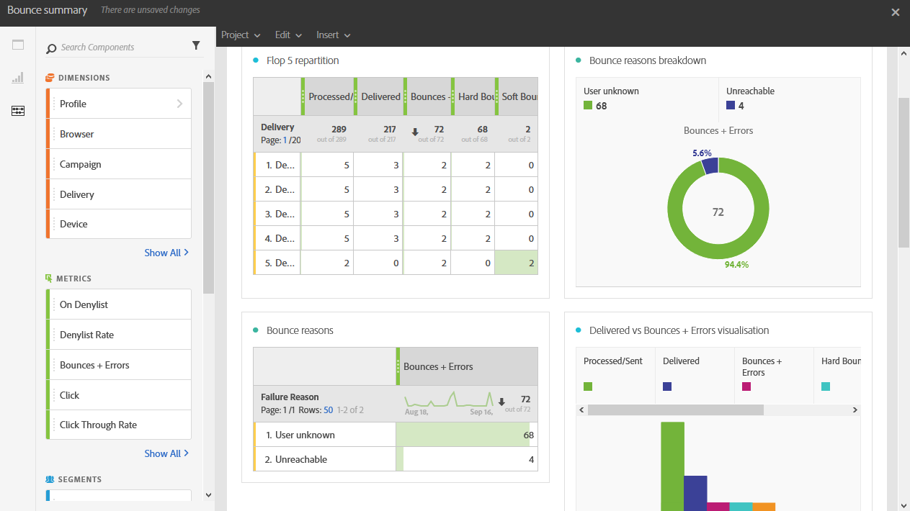

# Studssammanfattning{#bounce-summary}

Den här rapporten innehåller information om de övergripande hårdfel och mjuka fel som uppstått under leveranser samt den automatiska bearbetningen av studenterna.

Varje tabell representeras av sammanfattande nummer och diagram. Du kan ändra hur detaljerna visas i deras respektive visualiseringsinställningar.

**Ompartition med flyttal 5** anger de fem leveranser som har det högsta antalet karantän:

The **Brytningsorsaker** tabellen innehåller tillgängliga data för de typer av fel som orsakade studsar för varje leverans:

* **[!UICONTROL User unknown]**: Den typ av fel som genereras när en leverans skickas till en ogiltig e-postadress.
* **[!UICONTROL Invalid domain]**: Den typ av fel som genereras när en leverans skickas till en e-postadress vars domän är felaktig eller inte längre finns.
* **[!UICONTROL Unreachable]**: Den typ av fel som påträffades i meddelandeleveranssträngen, t.ex. en domän som inte kan nås temporärt.
* **[!UICONTROL Account disabled]**: Den typ av fel som genereras när en leverans skickas till en e-postadress som inte längre finns.
* **[!UICONTROL Mailbox full]**: Den typ av fel som genereras när mottagarens inkorg är full. Det görs fem försök att leverera meddelandet innan det här felet genereras.
* **[!UICONTROL Not connected]**: Den typ av fel som genereras när mottagarens mobiltelefon är avstängd eller inte är ansluten till ett nätverk när meddelandet skickas.

  >[!NOTE]
  >
  >Den här typen av fel gäller endast leveranser i mobilkanaler.

* **[!UICONTROL Refused]**: Den typ av fel som genereras när en adress nekas av Internet-leverantören. Exempel: när en säkerhetsregel har tillämpats av antispam-program.

The **Domänompartition** tabellen visar de övergripande problem som uppstått under leveranser enligt mottagardomänen.
