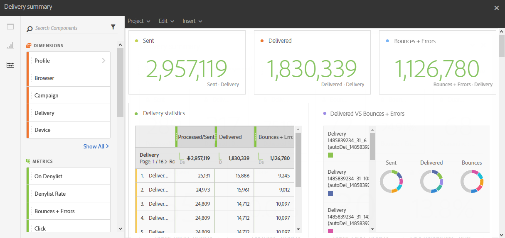

# Leveranssammanfattning{#delivery-summary}

Rapporten **[!UICONTROL Delivery summary]** innehåller information om huvudinformationen i förhållande till ett e-postmeddelande eller flera e-postmeddelanden.

Varje tabell representeras av sammanfattande nummer och diagram. Du kan ändra hur detaljerna visas i deras respektive visualiseringsinställningar.

Tabellen **Leveransstatistik** innehåller tillgängliga data för skickade e-postmeddelanden, som:

* **[!UICONTROL Processed/sent]**: Det totala antalet sändningar för leveransen.
* **[!UICONTROL Delivered]**: Antalet meddelanden som har skickats, i relation till det totala antalet skickade meddelanden. Fel som uppstår (studsar) beaktas. Klagomål (skräppostdeklarationer) och meddelanden som&quot;frånvaromeddelanden&quot; beaktas dock inte.
* **[!UICONTROL Bounces + Errors]**: Det totala antalet fel som har kumulerats under leverans och automatisk returbearbetning i relation till det totala antalet skickade meddelanden.

Tabellen **Öppna och klicka** innehåller tillgängliga data för mottagaraktivitet för varje leverans, till exempel:

* **Klicka**: Antalet gånger som ett innehåll klickades på i en leverans.
* **Öppna**: Antalet gånger som ett meddelande öppnades i en leverans.
* **Unika öppningar**: Antalet mottagare som öppnade leveransen.
* **Unika klick**: Antalet mottagare som klickade på ett innehåll i en leverans.

Tabellen **Domänompartition** visar status för leveranser enligt mottagarens domän.
