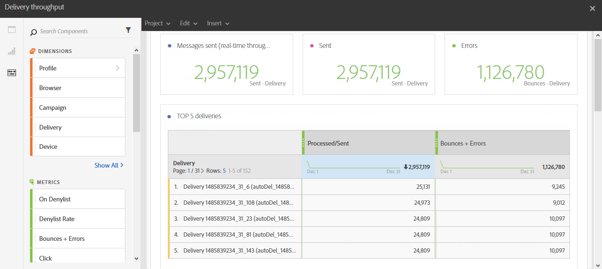

# Leveranskapacitet{#delivery-throughput}

Den här rapporten innehåller data som relaterar till leveransflödet för en sändning eller flera sändningar. Den innehåller följande:

* Antalet meddelanden som bearbetas per timme
* Tabellen **[!UICONTROL Top 5 deliveries]** och de kompletterande sammanfattningsnumren som visar de fem leveranserna med den största vinsten i återförsök.

>[!NOTE]
>
>På sidan **[!UICONTROL Delivery throughput]** visas dataöverföringshastigheten för vidarebefordran av meddelanden från Campaign till Adobe Campaign Enhanced MTA (Message Transfer Agent).
