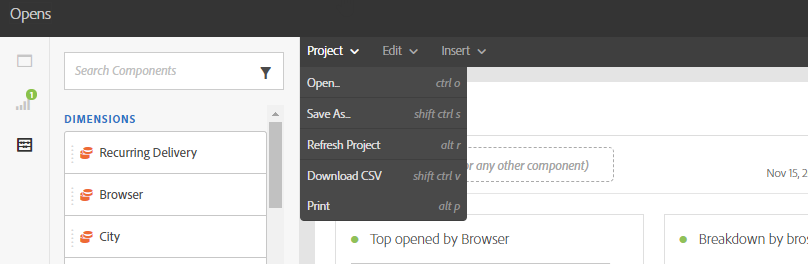

# Rapporteringsgränssnitt{#reporting-interface}

I det övre verktygsfältet kan du till exempel ändra, spara eller skriva ut rapporten.

Använd **Projekt** till:

* **Öppna...**: Öppnar en rapport eller mall som skapats tidigare.
* **Spara som...**: Mallar dupliceras så att de kan ändras.
* **Uppdatera projekt**: Uppdaterar rapporten baserat på nya data och ändringar i filter.
* **Hämta CSV**: Exporterar dina rapporter till en CSV-fil.

The **Redigera** kan du

* **Ångra**: Avbryter din senaste åtgärd på instrumentpanelen.
* **Rensa alla**: Tar bort alla paneler på kontrollpanelen.

The **Infoga** Med tabell kan du anpassa rapporter genom att lägga till diagram och tabeller på kontrollpanelen:

* **Ny tom panel**: Lägger till en ny tom panel på instrumentpanelen.
* **Ny frihandsfigur**: Lägger till en ny friformstabell på kontrollpanelen.
* **Ny rad**: Lägger till ett nytt linjediagram på instrumentpanelen.
* **Nytt fält**: Lägger till ett nytt stapeldiagram på instrumentpanelen.

**Relaterade ämnen:**

* [Lägga till paneler](adding-panels.md)
* [Lägga till visualiseringar](adding-visualizations.md)
* [Lägga till komponenter](adding-components.md)

## Tabbar {#tabs}

Med de vänstra flikarna kan du skapa en rapport och filtrera data efter behov.

Med de här flikarna får du tillgång till följande objekt:

* **[!UICONTROL Panels]**: lägg till en tom panel eller ett frihandsritat i rapporten för att börja filtrera dina data. Mer information finns i avsnittet Lägga till paneler
* **[!UICONTROL Visualizations]**: dra och släpp ett urval av visualiseringsobjekt för att ge rapporten en grafisk dimension. Mer information finns i avsnittet Lägga till visualiseringar.
* **[!UICONTROL Components]**: anpassa rapporter med olika dimensioner, mätvärden, segment och tidsperioder.

## Verktygsfält {#toolbar}

Verktygsfältet finns ovanför arbetsytan. Med olika flikar kan du till exempel ändra, spara, dela eller skriva ut rapporten.

**Relaterade ämnen:**

* [Lägga till paneler](adding-panels.md)
* [Lägga till visualiseringar](adding-visualizations.md)
* [Lägga till komponenter](adding-components.md)

### Fliken Projekt {#project-tab}

Använd **Projekt** till:

* **Öppna...**: Öppnar en rapport eller mall som skapats tidigare.
* **Spara som...**: Mallar dupliceras så att de kan ändras.
* **Uppdatera projekt**: Uppdaterar rapporten baserat på nya data och ändringar i filter.
* **Hämta CSV**: Exporterar dina rapporter till en CSV-fil.
* **[!UICONTROL Print]**: Skriv ut rapporten.

### Fliken Redigera {#edit-tab}

The **Redigera** kan du

* **Ångra**: Avbryter din senaste åtgärd på instrumentpanelen.
* **Rensa alla**: Tar bort alla paneler på kontrollpanelen.

### Infoga-flik {#insert-tab}

The **Infoga** kan du anpassa rapporter genom att lägga till diagram och tabeller på kontrollpanelen:

* **Ny tom panel**: Lägger till en ny tom panel på instrumentpanelen.
* **Ny frihandsfigur**: Lägger till en ny friformstabell på kontrollpanelen.
* **Ny rad**: Lägger till ett nytt linjediagram på instrumentpanelen.
* **Nytt fält**: Lägger till ett nytt stapeldiagram på instrumentpanelen.
