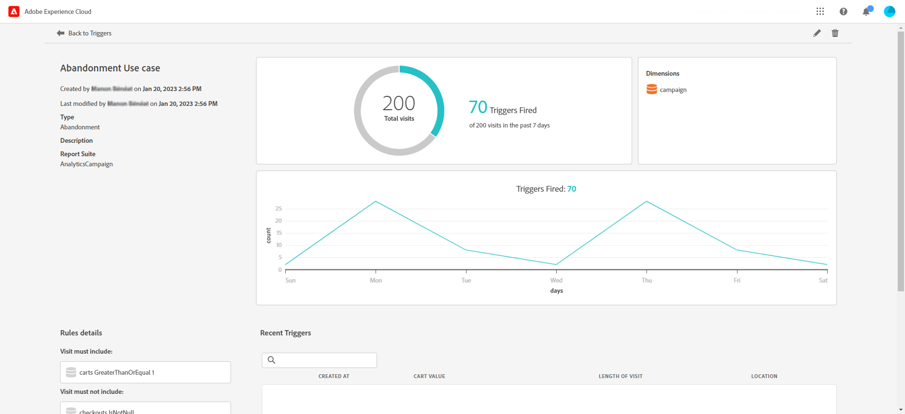

# Skapa en Experience Cloud-utlösare {#create-triggers}

>[!AVAILABILITY]
>
>Adobe Experience Cloud Triggers nya användargränssnitt lanseras stegvis för alla kunder. Kontakta din Adobe-representant om du vill veta mer.

Skapa en utlösare och konfigurera villkoren för utlösaren. Du kan till exempel ange villkor för en utlösares regler under ett besök, till exempel mått som Cart Abandon eller dimensioner som produktnamnet. När reglerna är uppfyllda körs utlösaren.

>[!NOTE]
>
> Det nya användargränssnittet för Experience Cloud Triggers ger en intuitiv upplevelse för att hantera konsumentbeteenden och personalisera användarupplevelser. Klicka på knappen **[!UICONTROL Go to classic mode]** om du vill växla tillbaka till det tidigare gränssnittet.

1. I Experience Cloud väljer du lösningsväljarmenyn och sedan **[!UICONTROL Triggers]**.

   

1. Klicka på **[!UICONTROL Create Trigger]** på startsidan för utlösaren och ange sedan typ av utlösare.

   Det finns tre typer av utlösare:

   * **[!UICONTROL Abandonment]**: Du kan skapa en utlösare som utlöses när en besökare tittar på en produkt, men inte lägger till något i kundvagnen.

   * **[!UICONTROL Action]**: Du kan skapa utlösare, till exempel för att utlösa problem efter anmälan av nyhetsbrev, e-postprenumerationer eller program för kreditkort (bekräftelser). Om du är återförsäljare kan du skapa en utlösare för en besökare som registrerar sig för ett lojalitetsprogram. I media och underhållning skapar du triggers för besökare som tittar på en viss show och kanske vill svara med en enkät.

   * **[!UICONTROL Session Start and Session End]**: Skapa en utlösare för händelser för sessionsstart och sessionsslut.

   

1. Lägg till en **[!UICONTROL Name]** och en **[!UICONTROL Description]** i utlösaren.

1. Välj Analytics **[!UICONTROL Report Suite]** som används för den här utlösaren. Den här inställningen identifierar de rapportdata som ska användas.

   [Läs mer om rapportsviten](https://experienceleague.adobe.com/docs/analytics/admin/admin-tools/manage-report-suites/c-new-report-suite/t-create-a-report-suite.html){target="_blank"}.

1. Välj giltighetsperioden för **[!UICONTROL Trigger after no action for]**.

1. Från kategorierna **[!UICONTROL Visit must include]** och **[!UICONTROL Visit must not include]** kan du definiera villkor eller besökarbeteenden som du vill eller inte vill ska förekomma. Du kan ange logiken **And** eller **Or** i eller mellan villkor, beroende på vilka villkor du anger.

   Regler för en enkel utlösare för övergivna varukorgar kan till exempel vara:

   * **[!UICONTROL Visit must include]**: `Carts (metric) Is greater or equal to 1` om du vill rikta in dig på besökare med minst ett objekt i kundvagnen.
   * **[!UICONTROL Visit must not include]**: `Checkout (metric) Exists.` om du vill ta bort besökare som har köpt objekten i sina kundvagnar.

   

1. Klicka på **[!UICONTROL Container]** för att upprätta och spara regler, villkor eller filter som definierar en utlösare. Om du vill att händelser ska inträffa samtidigt bör du placera dem i samma behållare.

   Varje behållare bearbetas oberoende på träffnivå, vilket innebär att om två behållare är kopplade till operatorn **[!UICONTROL And]** kvalificeras reglerna bara när två träffar uppfyller kraven.

1. Klicka på **[!UICONTROL + Dimension]** i fältet **[!UICONTROL Metadata]** för att välja en eller flera särskilda Campaign-dimensioner eller variabler som är relevanta för en besökares beteende.

   

1. Klicka på **[!UICONTROL Save]**.

1. Välj din nyskapade **[!UICONTROL Trigger]** i listan för att få tillgång till detaljrapporten om utlösaren.

   

1. Från den detaljerade vyn av utlösaren kan du få tillgång till rapporter om hur många utlösare som har utlösts. Om det behövs kan du redigera utlösaren med pennikonen.

   
